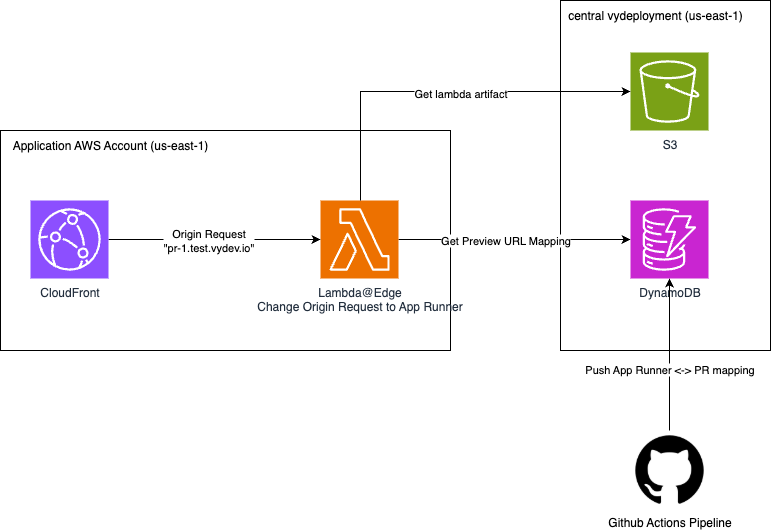

= Terraform AWS Preview URL

:!toc-title:
:!toc-placement:
:toc:

Create the relevant infrastructure to generate a preview URL for a web service.
Designed to work with link:https://github.com/nsbno/terraform-aws-ssr-site[`nsbno/terraform-aws-ssr-site`].

toc::[]

== Usage
Remember to check out the link:variables.tf[*variables*] and link:outputs.tf[*outputs*] to see all options.

[source, hcl]
----
module "preview_url" {
  source = "github.com/nsbno/terraform-aws-preview-url?ref=x.y.z"

  providers = {
    aws.us_east_1 = aws.us_east_1
  }

  service_name = "infrademo-demo-app"

  # Optional, if you want to share session with the main test session.
  dynamodb_sessions_table_arn = aws_dynamodb_table.sessions.arn
}
----

== Relevant Repositories

You can use these repos together with this repo!

link:https://github.com/nsbno/terraform-aws-ssr-site[`nsbno/terraform-aws-ssr-site`]::
Looking to deploy a server side rendered website (SSR). Use this module.

## Architecture

This module sets up the "Application AWS Account" part.